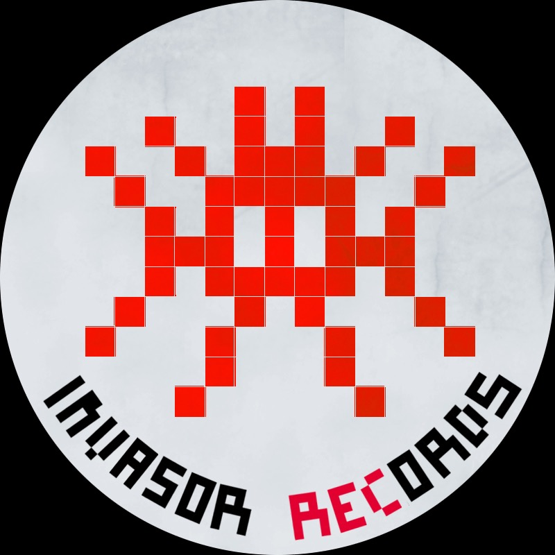
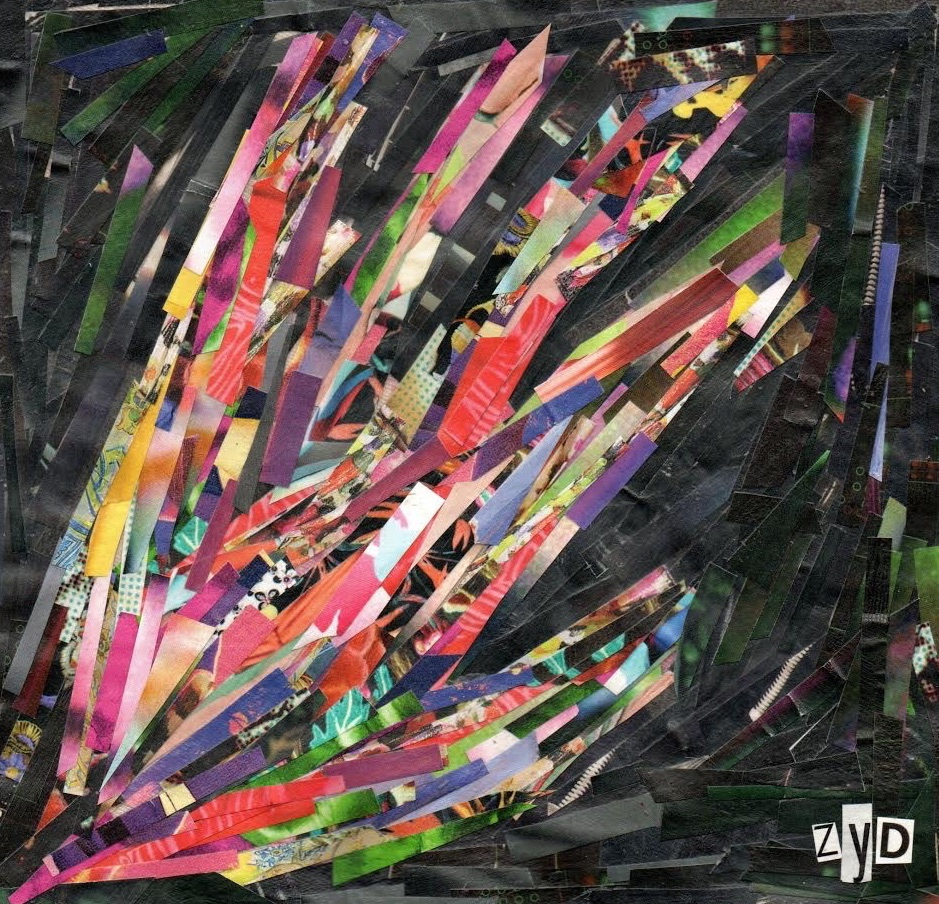

<!DOCTYPE html>
<html lang="en" dir="ltr">
	<head>
		<title>Invasor Records</title>
		<meta charset="utf-8"/>
		<meta name="viewport" content="width=device-width, initial-scale=1"/>
		<link rel="stylesheet" href="https://stackpath.bootstrapcdn.com/bootstrap/4.5.0/css/bootstrap.min.css" integrity="sha384-9aIt2nRpC12Uk9gS9baDl411NQApFmC26EwAOH8WgZl5MYYxFfc+NcPb1dKGj7Sk" crossorigin="anonymous"/>
		<link rel="stylesheet" href="css/menu.css">
	</head>

	<body>
		

			

				<header>
				</header>
				<main>
					

						

							

								<button type="button" class="btn btn-info dropdown-toggle" data-toggle="dropdown">
									Invasor Records
									
								</button>
								

									

										<a class="dropdown-item" href="https://www.instagram.com/invasormunne/">Instagram</a>
									

									

										<a class="dropdown-item" href="https://www.youtube.com/watch?v=OQqi03k4X3A&list=PL1CZ2zeY7iysX_pK6KFPYHO38nuApupev">YouTube</a>
									

									

										<a class="dropdown-item" href="https://open.spotify.com/artist/4V20Brhze2KpJRS6D7oZoU">Spotify</a>
									

									

									

										<a class="dropdown-item" href="mailto:invasorrecords@gmail.com">Mail</a>
									

								

							

							

								<h1>La Verdadera Invasión</h1>
								<h2>Instrucciones:</h2>
								<ul>
									<li>Haga click en la mano para iniciar.</li>
									<li>Una vez dentro haga click en Load Audio y después en Play.</li>
									<li>Al hacer click en esta nueva pantalla dibuje y escuche los raps.</li>
									<li>Recorra con su mouse la pantalla.</li>
									<li>Si está en su celular asegúrese de no tenerlo en silencio, se recomienda el uso de Google Chrome para un óptimo funcionamiento.</li>

								</ul>
							

							

								<h3>Ficha Tecnica</h3>
								<ul>
									<li>Beats: Munné</li>
									<li>Voces: Aleymu, Callandroll, Delni, Diley, Perro Galactico, Töt, Socre</li>
									<li>Grabado en distintos universos</li>
									<li>Producido durante la cuarentena del 2020 por Invasor Records</li>
									<li>Arte de tapa: Zoelandia</li>
								</ul>
							

						

						

							

								
							

						

					

				</main>
				<footer>
					

						

							

								 Esta obra está bajo una <a rel="license" href="http://creativecommons.org/licenses/by-nc-nd/4.0/">Licencia Creative Commons Atribución – No Comercial – Sin Obra Derivada 4.0 Internacional</a>.
								<b>Copyright © Todos los derechos reservados</b>
								

									Todos los contenidos de este Sitio (Incluyendo, pero no limitado a, texto, logotipos, contenido, fotografías, audio, botones, nombres comerciales y vídeo) están sujetos a derechos de propiedad por las leyes de Derechos de Autor y demás Leyes relativas Internacionales a David Munné y de terceros titulares de los mismos que han autorizado debidamente su inclusión.
									En ningún caso se entenderá que se concede licencia alguna o se efectúa renuncia, transmisión, cesión total o parcial de dichos derechos ni se confiere ningún derecho, y en especial, de alteración, explotación, reproducción, distribución o comunicación publica sobre dichos contenido sin la previa autorización expresa de David Munné o de los titulares correspondientes.
									El uso de imágenes, fragmentos de videos y demás material que sea objeto de protección de los derechos de autor, será exclusivamente para fines educativos e informativos, y cualquier uso distinto como el lucro, reproducción, edición o modificación, será perseguido y sancionado por el respectivo titular de los Derechos de Autor.
								

							

						

					

				</footer>
			

		

		
		
		
		
	</body>
</html>
